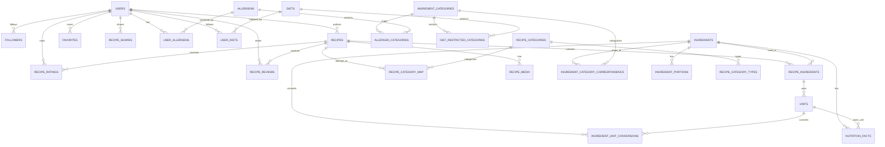

# Recipe Database Model Diagram

```mermaid
erDiagram
    USERS ||--o{ FOLLOWERS : "follows"
    USERS ||--o{ RECIPES : "authors"
    USERS ||--o{ RECIPE_RATINGS : "rates"
    USERS ||--o{ RECIPE_REVIEWS : "writes"
    USERS ||--o{ FAVORITES : "saves"
    USERS ||--o{ RECIPE_SHARES : "shares"
    USERS ||--o{ USER_ALLERGENS : "has"
    USERS ||--o{ USER_DIETS : "follows"
    
    RECIPES ||--o{ RECIPE_INGREDIENTS : "contains"
    RECIPES ||--o{ RECIPE_CATEGORY_MAP : "belongs_to"
    RECIPES ||--o{ RECIPE_MEDIA : "has"
    RECIPES ||--o{ RECIPE_REVIEWS : "receives"
    RECIPES ||--o{ RECIPE_RATINGS : "receives"
    
    INGREDIENTS ||--o{ RECIPE_INGREDIENTS : "used_in"
    INGREDIENTS ||--o{ INGREDIENT_CATEGORY_CORRESPONDENCE : "maps_to"
    INGREDIENTS ||--o{ NUTRITION_FACTS : "has"
    INGREDIENTS ||--o{ INGREDIENT_UNIT_CONVERSIONS : "converts"
    INGREDIENTS ||--o{ INGREDIENT_PORTIONS : "has"
    
    RECIPE_INGREDIENTS ||--o{ UNITS : "uses"
    
    RECIPE_CATEGORIES ||--o{ RECIPE_CATEGORY_MAP : "categorizes"
    RECIPE_CATEGORIES ||--o{ RECIPE_CATEGORY_TYPES : "types"
    
    INGREDIENT_CATEGORIES ||--o{ INGREDIENT_CATEGORY_CORRESPONDENCE : "categorizes"
    INGREDIENT_CATEGORIES ||--o{ ALLERGEN_CATEGORIES : "maps"
    INGREDIENT_CATEGORIES ||--o{ DIET_RESTRICTED_CATEGORIES : "restricts"
    
    ALLERGENS ||--o{ ALLERGEN_CATEGORIES : "restricts"
    ALLERGENS ||--o{ USER_ALLERGENS : "restricted_by"
    
    DIETS ||--o{ DIET_RESTRICTED_CATEGORIES : "restricts"
    DIETS ||--o{ USER_DIETS : "followed_by"
    
    UNITS ||--o{ INGREDIENT_UNIT_CONVERSIONS : "converts"
    UNITS ||--o{ NUTRITION_FACTS : "base_unit"
```
