# Recipe Database Model Diagram

```mermaid
erDiagram
    USERS {
        integer **id**
        varchar username
        varchar avatar
        varchar status
        varchar role
        timestamptz last_seen_at
        timestamptz created_at
        timestamptz updated_at
    }
    
    FOLLOWERS {
        integer **user_id**
        integer **followed_id**
        timestamptz created_at
    }
    
    RECIPES {
        integer **id**
        jsonb title
        jsonb description
        jsonb instructions
        integer servings
        smallint spiciness
        integer *author_id*
        varchar status
        numeric rating_avg
        integer rating_count
        timestamptz created_at
        timestamptz updated_at
    }
    
    INGREDIENTS {
        integer **id**
        varchar name
        timestamptz created_at
    }
    
    UNITS {
        varchar **code**
        varchar kind
    }
    
    RECIPE_INGREDIENTS {
        integer **recipe_id**
        integer **ingredient_id**
        numeric amount
        varchar unit
    }
    
    RECIPE_CATEGORY_TYPES {
        integer **id**
        varchar code
        varchar name
        timestamptz created_at
    }
    
    RECIPE_CATEGORIES {
        integer **id**
        integer *category_type_id*
        varchar code
        timestamptz created_at
    }
    
    RECIPE_CATEGORY_MAP {
        integer **recipe_id**
        integer **category_id**
    }
    
    INGREDIENT_CATEGORIES {
        integer **id**
        varchar code
        timestamptz created_at
    }
    
    INGREDIENT_CATEGORY_CORRESPONDENCE {
        integer **ingredient_id**
        integer **category_id**
    }
    
    ALLERGENS {
        integer **id**
        varchar code
        timestamptz created_at
    }
    
    ALLERGEN_CATEGORIES {
        integer **allergen_id**
        integer **category_id**
    }
    
    USER_ALLERGENS {
        integer **user_id**
        integer **allergen_id**
        timestamptz created_at
    }
    
    DIETS {
        integer **id**
        varchar code
        varchar name
        timestamptz created_at
    }
    
    DIET_RESTRICTED_CATEGORIES {
        integer **diet_id**
        integer **category_id**
    }
    
    USER_DIETS {
        integer **user_id**
        integer **diet_id**
        timestamptz created_at
    }
    
    INGREDIENT_UNIT_CONVERSIONS {
        integer **ingredient_id**
        varchar **unit**
        numeric grams
        timestamptz created_at
    }
    
    NUTRITION_FACTS {
        integer **ingredient_id**
        numeric calories
        numeric protein
        numeric fat
        numeric carbs
        varchar base_unit
        timestamptz created_at
    }
    
    INGREDIENT_PORTIONS {
        integer **id**
        integer *ingredient_id*
        varchar name
        numeric weight_in_grams
        timestamptz created_at
    }
    
    FAVORITES {
        integer **user_id**
        integer **recipe_id**
        timestamptz created_at
    }
    
    RECIPE_SHARES {
        integer **user_id**
        integer **recipe_id**
        timestamptz created_at
    }
    
    RECIPE_MEDIA {
        integer **id**
        integer *recipe_id*
        varchar type
        varchar url
        integer position
        timestamptz created_at
    }
    
    RECIPE_REVIEWS {
        integer **id**
        integer *recipe_id*
        integer *author_id*
        text body
        boolean is_deleted
        timestamptz created_at
        timestamptz updated_at
    }
    
    RECIPE_RATINGS {
        integer **user_id**
        integer **recipe_id**
        smallint rating
        timestamptz created_at
        timestamptz updated_at
    }
    
    USERS ||--o{ FOLLOWERS : "follows"
    USERS ||--o{ RECIPES : "authors"
    USERS ||--o{ RECIPE_RATINGS : "rates"
    USERS ||--o{ RECIPE_REVIEWS : "writes"
    USERS ||--o{ FAVORITES : "saves"
    USERS ||--o{ RECIPE_SHARES : "shares"
    USERS ||--o{ USER_ALLERGENS : "has"
    USERS ||--o{ USER_DIETS : "follows"
    
    RECIPES ||--o{ RECIPE_INGREDIENTS : "contains"
    RECIPES ||--o{ RECIPE_CATEGORY_MAP : "belongs_to"
    RECIPES ||--o{ RECIPE_MEDIA : "has"
    RECIPES ||--o{ RECIPE_REVIEWS : "receives"
    RECIPES ||--o{ RECIPE_RATINGS : "receives"
    
    INGREDIENTS ||--o{ RECIPE_INGREDIENTS : "used_in"
    INGREDIENTS ||--o{ INGREDIENT_CATEGORY_CORRESPONDENCE : "maps_to"
    INGREDIENTS ||--o{ NUTRITION_FACTS : "has"
    INGREDIENTS ||--o{ INGREDIENT_UNIT_CONVERSIONS : "converts"
    INGREDIENTS ||--o{ INGREDIENT_PORTIONS : "has"
    
    RECIPE_INGREDIENTS ||--o{ UNITS : "uses"
    
    RECIPE_CATEGORIES ||--o{ RECIPE_CATEGORY_MAP : "categorizes"
    RECIPE_CATEGORIES ||--o{ RECIPE_CATEGORY_TYPES : "types"
    
    INGREDIENT_CATEGORIES ||--o{ INGREDIENT_CATEGORY_CORRESPONDENCE : "categorizes"
    INGREDIENT_CATEGORIES ||--o{ ALLERGEN_CATEGORIES : "maps"
    INGREDIENT_CATEGORIES ||--o{ DIET_RESTRICTED_CATEGORIES : "restricts"
    
    ALLERGENS ||--o{ ALLERGEN_CATEGORIES : "restricts"
    ALLERGENS ||--o{ USER_ALLERGENS : "restricted_by"
    
    DIETS ||--o{ DIET_RESTRICTED_CATEGORIES : "restricts"
    DIETS ||--o{ USER_DIETS : "followed_by"
    
    UNITS ||--o{ INGREDIENT_UNIT_CONVERSIONS : "converts"
    UNITS ||--o{ NUTRITION_FACTS : "base_unit"
```

## Auth Database Collections

### userModel

| Field | Type | Required | Unique |
|-------|------|----------|--------|
| _id | ObjectId | ✓ | ✓ |
| id | Number | ✓ | ✓ |
| email | String | ✓ | ✓ |
| passwordHash | String | ✓ | |
| googleID | String | | ✓ |

### userCounter

| Field | Type | Required | Unique | Default |
|-------|------|----------|--------|---------|
| _id | ObjectId | ✓ | ✓ | |
| name | String | ✓ | ✓ | "CounterDB" |
| seq | Number | ✓ | | 1 |
