*This project has been created as part of the 42 curriculum by azinchen, msavelie, ssalorin, jkarhu, elehtone.*

# ft_transcendence

A recipe sharing platform with a clean interface, social features and AI integration.

---

# Description

## Project Overview

Our ft_transcendence project, **Recipe Creating Platform (RCP)**, is a full-stack web application designed to help users discover, create, and manage recipes with comprehensive social features. The product enables users to share their culinary creations, follow other cooking enthusiasts (cooks), save favourite recipes, leave comments, and explore a rich collection of user-generated culinary content.

## Key Features

- **Recipe Discovery & Browsing**: Browse and search recipes with filtering and sorting options
- **Social Features**: Follow other cooks, view their profiles, and see their recipe collections
- **User Profiles**: Customisable user profiles with avatar support and online status visibility
- **Recipe Management**: Create, edit, and publish recipes with multilingual support
- **Community Interaction**: Comment on recipes, rate dishes, and build a community around shared culinary interests
- **Favourites**: Save favourite recipes for quick access
- **Multi-language Support**: Support for English, Finnish, and Russian languages

---

# Team members and roles

Teams are required to consist of at least 4 and at most 5 members. Ours consisted of 5 members at kick-off.

## Team members

Our team consists of 5 members:
- Anya Zinchenko (azinchen)
- Nick Saveliev (msavelie)
- Seela Salorinta (ssalorin)
- Jimi Karhu (jkarhu)
- Eric Lehtonen (elehtone)

## Mandatory Roles

- **Product Owner**: Overall project vision, work priority and validation of completed work.
	- Anya and Nick shared this role at various stages during the project
- **Project Manager**: Project planning, communication and deadlines.
	- Anya
- **Technical Lead**: Leads architecture and stack decisions, code quality, and critical reviews.
	- Nick
- **Developers**: Implement features, review code, test, and document contributions.
	- All 5 of us were developers to various degrees

---

# Instructions

## Prerequisites

Before starting the project, ensure the following tools are installed on your system:

| Tool | Minimum version | Version check (bash) |
|------|---------|-----------|
| Docker | 20.10 | `docker --version` |
| Docker Compose | 1.29 | `docker-compose --version` |
| GNU Make | Any modern version | `make --version` |
| Node.js | 20 | `node --version` |
| npm | 10 | `npm --version` |

## Environment Configuration

Each service requires environment variable configuration. Copy the `env.template` files to `.env`:

```bash
# Root project level
cp .env.template .env

# Backend services
cp backend/services/api-gateway/.env.template backend/services/api-gateway/.env
cp backend/services/core-service/.env.template backend/services/core-service/.env
cp backend/services/auth-service/.env.template backend/services/auth-service/.env
```

Replace placeholder values (e.g., `JWT_SECRET="your-super-secret-jwt-key-min-32-chars"`) with appropriate configuration values for your environment.

## Running the Project

### Start all services via Docker Compose:

```bash
make up
```

Bear in mind `sudo` is not available on Hive systems.

This command:
- Generates certificates if needed
- Starts all database containers (MongoDB for auth, PostgreSQL for core)
- Launches all backend services (API Gateway, Auth Service, Core Service)
- Configures Traefik reverse proxy for HTTPS routing
- Exposes the application at `https://localhost:8443`

Useful management commands:

| Command | Description |
|---------|-------------|
| `make down` | Stop all services |
| `make restart` | Restart the entire stack |
| `make logs` | Watch logs for all services |
| `make db-status` | View container health status |
| `make db-reset` | Reset database containers and volumes |
| `make clean` | Full cleanup including all volumes |
| `make re` | Full cleanup and restart |

### Accessing the Application

- **Frontend**: `https://localhost:8443` (or `https://localhost`)
- **API Gateway**: `http://localhost:3000` (internal/development)
- **Auth Service**: `http://auth-service:3001` (internal Docker network)
- **Core Service**: `http://core-service:3002` (internal Docker network)
- **Traefik Dashboard**: `http://localhost:8080` (traffic and routing visualisation)

## Testing

The project uses **Jest** and **Supertest** for integration testing.

### How to Run Tests

From the project root:

```bash
# Run all tests for all services
make test-jest-all

# Run tests for a specific service using the root Makefile
make test-jest-core
make test-jest-api

# Alternative: run directly in the service directory via npm
cd backend/services/core-service && npm test
cd backend/services/api-gateway && npm test

# Run tests in "watch" mode (re-runs on file changes)
cd backend/services/core-service && npm run test:watch
cd backend/services/api-gateway && npm run test:watch
```

---

# Resources

## Documentation References

- [Express.js Documentation](https://expressjs.com/)
- [React 19 Documentation](https://react.dev/)
- [React Router v7 Documentation](https://react-router.dev/)
- [PostgreSQL Database Documentation](https://www.postgresql.org/docs/)
- [MongoDB Documentation](https://docs.mongodb.com/)
- [TypeScript Handbook](https://www.typescriptlang.org/docs/)
- [Traefik Reverse Proxy Documentation](https://doc.traefik.io/)
- [Docker & Docker Compose Documentation](https://docs.docker.com/)

## AI Usage in This Project

AI tools (such as GitHub Copilot and Claude Code) were used int he following ways:

- Researching new concepts or tools efficiently
- Writing documentation drafts and templates
- Assistance with mundane code generation
- Initial code review and sanity checking
- Test evaluation and test testing, to make sure testy tests test testily

A practical example of AI usage is this here README. Initial work was done by passing the README requirements section of the subject PDF to the AI and asking it to generate a readme for our project. We worked that into the end result you see here.

All AI-generated code passes before human eyes prior to any use in the project.

---

# Tech stack

## Frontend

- **Framework**: React 19 with React Router v7
- **Language**: TypeScript 5.9+
- **Build Tool**: Vite 7.1
- **Styling**: <unknown or lacking> (CSS framework or solution)
- **State Management**: React Context API / <unknown or lacking>
- **Internationalisation**: react-i18next with remix-i18next
- **Form Validation**: Zod 4.3
- **Component Library**: Iconoir React (icons)
- **HTTP Client**: <unknown or lacking>

**Rationale**: React Router v7 provides modern, performant routing with server-side rendering capabilities. Vite ensures fast development build cycles and optimised production bundles. TypeScript provides type safety across the frontend layer.

## Backend

- **API Gateway**: Express.js 4.18 with TypeScript
- **Service Architecture**: Microservices pattern with three independent services
- **Language**: TypeScript 5.9+
- **Authentication Service**: Node.js with Express
- **Core Service**: Node.js with Express
- **Form Validation**: Zod 4.3 for schema validation
- **Testing**: Jest 30.3 with Supertest

**Rationale**: Express provides a lightweight, flexible HTTP server foundation. Microservices architecture enables independent scaling and deployment of different concerns (authentication, recipes, notifications).

## Databases

- **Auth Database**: MongoDB 6 (stores user authentication credentials and sessions)
  - **Port**: 27017
  - **Credentials**: Configurable via environment variables
  
- **Core Database**: PostgreSQL 15 (stores recipes, users, followers, ratings, comments)
  - **Port**: 5433
  - **Name**: `core_db`
  
**Rationale**: PostgreSQL selected for relational data (recipes, users, followers) with ACID compliance. MongoDB selected for flexible authentication session storage. Separate databases enable independent scaling and failure isolation.

## Infrastructure & DevOps

- **Containerisation**: Docker & Docker Compose
- **Reverse Proxy & Load Balancing**: Traefik v3.0
- **SSL/TLS**: Self-signed certificates for HTTPS
- **Service Orchestration**: Docker Compose (development/staging); Kubernetes manifests available for production

**Rationale**: Docker ensures consistency across development and production environments. Traefik provides automatic HTTPS routing and service discovery within the containerised environment.

---

# Features List

## Core Features (Implemented)

| Feature | Description | Owner(s) | Status |
|---------|-------------|----------|--------|
| User Registration & Authentication | Secure user account creation and login | Eric | <unknown or lacking> |
| User Profiles | Customisable user profiles with avatar support | <unknown or lacking> | <unknown or lacking> |
| Recipe Creation | Users can create and publish recipes | <unknown or lacking> | <unknown or lacking> |
| Recipe Discovery | Browse and search recipes with filtering | <unknown or lacking> | <unknown or lacking> |
| Favourites | Save recipes to favourites list | <unknown or lacking> | <unknown or lacking> |
| Follow System | Follow other cooks, view follower lists | <unknown or lacking> | <unknown or lacking> |
| Comments | Leave comments on recipes | <unknown or lacking> | <unknown or lacking> |
| Recipe Ratings | Rate recipes (1–5 stars) | <unknown or lacking> | <unknown or lacking> |
| Multilingual Support | Interface in English, Finnish, Russian | <unknown or lacking> | <unknown or lacking> |
| Responsive Design | Mobile and desktop compatibility | <unknown or lacking> | <unknown or lacking> |

# Modules

## Module Strategy

Due to the time pressure we had for this project we agreed on a module selection that gave us some leeway for change but should easily allow us to meet the required minimum. Our plan consisted of modules totalling 20 points. This gives us ample flexibility should problems or unseen issues arrive. This also gives us some flexibility should an evaluator encounter a critical failure.

## Planned Modules

### WEB - 5 points

| Module Name | Type | Points | Notes |
|-------------|------|--------|-------|
| Framework for Frontend and Backend | Major | 2 | React 19 (frontend) and Express.js (backend) implemented |
| Server-Side Rendering (SSR) | Minor | 1 | React Router v7 with server-side rendering capabilities |
| Custom Design System | Minor | 1 | Reusable components with consistent color palette, typography, and Iconoir icons |
| Advanced Search Functionality | Minor | 1 | Filtering, sorting, and pagination implemented across recipes and users |

### Accessibility and Internationalization - 4 points

| Module Name | Type | Points | Notes |
|-------------|------|--------|-------|
| WCAG 2.1 AA Accessibility Compliance | Major | 2 | Screen reader support, keyboard navigation, and assistive technology support |
| Multiple Language Support | Minor | 1 | Support for English, Finnish, and Russian using react-i18next |
| Additional Browser Support | Minor | 1 | Responsive design and cross-browser compatibility |

### User Management - 5 points

| Module Name | Type | Points | Notes |
|-------------|------|--------|-------|
| Standard User Management and Authentication | Major | 2 | Secure registration, login, and JWT-based authentication |
| OAuth 2.0 Remote Authentication | Minor | 1 | Google OAuth integration for single sign-on |
| Advanced Permissions System | Major | 2 | Role-based access control (admin, user, guest) |

### Artificial Intelligence - 4 points

| Module Name | Type | Points | Notes |
|-------------|------|--------|-------|
| RAG (Retrieval-Augmented Generation) System | Major | 2 | Complete RAG implementation for intelligent content retrieval |
| Machine Learning Recommendation System | Major | 2 | ML-based recommendation engine for recipe suggestions |

### Devops - 2 points

| Module Name | Type | Points | Notes |
|-------------|------|--------|-------|
| Microservices Architecture | Major | 2 | Backend implemented as microservices (Auth, Core, Search, Translation services) |

**Total Points: 20**

---

# Database Schema

## Recipe erDiagram

```mermaid
erDiagram
    USERS {
        integer **id**
        varchar username
        varchar avatar
        varchar status
        varchar role
        timestamptz last_seen_at
        timestamptz created_at
        timestamptz updated_at
    }
    
    FOLLOWERS {
        integer **user_id**
        integer **followed_id**
        timestamptz created_at
    }
    
    RECIPES {
        integer **id**
        jsonb title
        jsonb description
        jsonb instructions
        integer servings
        smallint spiciness
        integer *author_id*
        varchar status
        numeric rating_avg
        integer rating_count
        timestamptz created_at
        timestamptz updated_at
    }
    
    INGREDIENTS {
        integer **id**
        varchar name
        timestamptz created_at
    }
    
    UNITS {
        varchar **code**
        varchar kind
    }
    
    RECIPE_INGREDIENTS {
        integer **recipe_id**
        integer **ingredient_id**
        numeric amount
        varchar unit
    }
    
    RECIPE_CATEGORY_TYPES {
        integer **id**
        varchar code
        varchar name
        timestamptz created_at
    }
    
    RECIPE_CATEGORIES {
        integer **id**
        integer *category_type_id*
        varchar code
        timestamptz created_at
    }
    
    RECIPE_CATEGORY_MAP {
        integer **recipe_id**
        integer **category_id**
    }
    
    INGREDIENT_CATEGORIES {
        integer **id**
        varchar code
        timestamptz created_at
    }
    
    INGREDIENT_CATEGORY_CORRESPONDENCE {
        integer **ingredient_id**
        integer **category_id**
    }
    
    ALLERGENS {
        integer **id**
        varchar code
        timestamptz created_at
    }
    
    ALLERGEN_CATEGORIES {
        integer **allergen_id**
        integer **category_id**
    }
    
    USER_ALLERGENS {
        integer **user_id**
        integer **allergen_id**
        timestamptz created_at
    }
    
    DIETS {
        integer **id**
        varchar code
        varchar name
        timestamptz created_at
    }
    
    DIET_RESTRICTED_CATEGORIES {
        integer **diet_id**
        integer **category_id**
    }
    
    USER_DIETS {
        integer **user_id**
        integer **diet_id**
        timestamptz created_at
    }
    
    INGREDIENT_UNIT_CONVERSIONS {
        integer **ingredient_id**
        varchar **unit**
        numeric grams
        timestamptz created_at
    }
    
    NUTRITION_FACTS {
        integer **ingredient_id**
        numeric calories
        numeric protein
        numeric fat
        numeric carbs
        varchar base_unit
        timestamptz created_at
    }
    
    INGREDIENT_PORTIONS {
        integer **id**
        integer *ingredient_id*
        varchar name
        numeric weight_in_grams
        timestamptz created_at
    }
    
    FAVORITES {
        integer **user_id**
        integer **recipe_id**
        timestamptz created_at
    }
    
    RECIPE_SHARES {
        integer **user_id**
        integer **recipe_id**
        timestamptz created_at
    }
    
    RECIPE_MEDIA {
        integer **id**
        integer *recipe_id*
        varchar type
        varchar url
        integer position
        timestamptz created_at
    }
    
    RECIPE_REVIEWS {
        integer **id**
        integer *recipe_id*
        integer *author_id*
        text body
        boolean is_deleted
        timestamptz created_at
        timestamptz updated_at
    }
    
    RECIPE_RATINGS {
        integer **user_id**
        integer **recipe_id**
        smallint rating
        timestamptz created_at
        timestamptz updated_at
    }
    
    USERS ||--o{ FOLLOWERS : "follows"
    USERS ||--o{ RECIPES : "authors"
    USERS ||--o{ RECIPE_RATINGS : "rates"
    USERS ||--o{ RECIPE_REVIEWS : "writes"
    USERS ||--o{ FAVORITES : "saves"
    USERS ||--o{ RECIPE_SHARES : "shares"
    USERS ||--o{ USER_ALLERGENS : "has"
    USERS ||--o{ USER_DIETS : "follows"
    
    RECIPES ||--o{ RECIPE_INGREDIENTS : "contains"
    RECIPES ||--o{ RECIPE_CATEGORY_MAP : "belongs_to"
    RECIPES ||--o{ RECIPE_MEDIA : "has"
    RECIPES ||--o{ RECIPE_REVIEWS : "receives"
    RECIPES ||--o{ RECIPE_RATINGS : "receives"
    
    INGREDIENTS ||--o{ RECIPE_INGREDIENTS : "used_in"
    INGREDIENTS ||--o{ INGREDIENT_CATEGORY_CORRESPONDENCE : "maps_to"
    INGREDIENTS ||--o{ NUTRITION_FACTS : "has"
    INGREDIENTS ||--o{ INGREDIENT_UNIT_CONVERSIONS : "converts"
    INGREDIENTS ||--o{ INGREDIENT_PORTIONS : "has"
    
    RECIPE_INGREDIENTS ||--o{ UNITS : "uses"
    
    RECIPE_CATEGORIES ||--o{ RECIPE_CATEGORY_MAP : "categorizes"
    RECIPE_CATEGORIES ||--o{ RECIPE_CATEGORY_TYPES : "types"
    
    INGREDIENT_CATEGORIES ||--o{ INGREDIENT_CATEGORY_CORRESPONDENCE : "categorizes"
    INGREDIENT_CATEGORIES ||--o{ ALLERGEN_CATEGORIES : "maps"
    INGREDIENT_CATEGORIES ||--o{ DIET_RESTRICTED_CATEGORIES : "restricts"
    
    ALLERGENS ||--o{ ALLERGEN_CATEGORIES : "restricts"
    ALLERGENS ||--o{ USER_ALLERGENS : "restricted_by"
    
    DIETS ||--o{ DIET_RESTRICTED_CATEGORIES : "restricts"
    DIETS ||--o{ USER_DIETS : "followed_by"
    
    UNITS ||--o{ INGREDIENT_UNIT_CONVERSIONS : "converts"
    UNITS ||--o{ NUTRITION_FACTS : "base_unit"
```



## Auth Database Collections

### userModel

Stores registered users' data.

| Field | Type | Required | Unique |
|-------|------|----------|--------|
| _id | ObjectId | ✓ | ✓ |
| id | Number | ✓ | ✓ |
| email | String | ✓ | ✓ |
| passwordHash | String | ✓ | |
| googleID | String | | ✓ |

### userCounter

Used in the function to generate the next userId.

| Field | Type | Required | Unique | Default |
|-------|------|----------|--------|---------|
| _id | ObjectId | ✓ | ✓ | |
| name | String | ✓ | ✓ | "CounterDB" |
| seq | Number | ✓ | | 1 |

# Rationale for tech choices

## Database choice:
This project uses multiple databases, each chosen to suit the way the relevant service stores and queries data.

Each microservice owns its database and is the single source of truth for its data.

* The authentication service stores identity and credential data in MongoDB.
* The core service stores business data in PostgreSQL.

This separation:
* keeps the services loosely coupled by isolating their data and responsibilities
* simplifies scaling and maintenance
* aligns with microservice best practices
* avoids cross-service database access

**PostgreSQL**
PostgreSQL is used for the core service, where the system relies heavily on:
* strong relationships between entities
* referential integrity across related records
* transactional consistency
* complex queries and filtering
* many-to-many relationships

Core domain features such as public profiles, recipes, ingredients, categories, followers, favourites, and comments require reliable consistency and explicit relationships between entities, which relational databases provide naturally.

PostgreSQL was selected due to:
* ACID-compliant transactions
* rich support for relational modelling
* advanced indexing capabilities
* support for complex joins and constraints
* suitability for scalable microservice architectures with strict data ownership

These characteristics are important for maintaining data correctness under concurrent operations and higher read/write load.

PostgreSQL is also widely used in modern development, making it a practical and familiar choice.

**MongoDB**
MongoDB is used exclusively by the authentication service.

Authentication data has different characteristics from the core domain:
* flexible and evolving schema (allows schema changes without costly migrations)
* no complex joins
* high read/write frequency
* isolated data ownership

MongoDB is a good fit for this use case because it:
* allows flexible document-based modelling
* simplifies storage of authentication-related data
* avoids unnecessary relational overhead
* remains isolated from core domain data

Using MongoDB for authentication keeps sensitive credential data decoupled from the core relational database, which improves security and scalability.

## Microservices:
The system is divided into microservices based on clearly defined responsibilities: authentication, core domain logic, and request routing.
Each service owns its data and encapsulates a single responsibility, while the API Gateway acts as the unified entry point for client requests.

Business logic lives within the individual services, while cross-cutting concerns are handled at the gateway level.

### API Gateway

Responsibility:
* Acts as the single entry point for all client requests.

Contains:
* Request routing to internal services
* JWT validation and authentication middleware
* Rate limiting and API key validation
* Request/response logging
* Basic request validation
* Response aggregation (if needed)

Does NOT contain:
* Business logic
* Database access

### Auth Service

Responsibility:
* Manages authentication and user identity.

Contains:
* User registration and login
* Password hashing and verification
* JWT and refresh token generation
* OAuth 2.0 integration (Google)
* Two-factor authentication logic (auth app)
* Token revocation and session management

Database: auth_db (MongoDB)

### Core Service

Responsibility:
Manages the core business domain of the application, including user profiles, recipes, and social interactions.

Contains:
* User profile management (public profile data)
* Avatar metadata management
* Recipes CRUD operations
* Ingredients, categories, and dietary data management
* Favourites and user–recipe interactions
* Followers system (mutual follows treated as friends)
* Comments on recipes
* Advanced filtering and search across recipes
* Domain-specific business rules and validations

Database: core_db (PostgreSQL)
