*This project has been created as part of the 42 curriculum by azinchen, msavelie, ssalorin, jkarhu, elehtone.*

# ft_transcendence

A recipe sharing platform with a clean interface, social features and AI integration.

---

# Description

## Project overview

Our ft_transcendence project, **Recipe Creating Platform (RCP)**, is a full-stack web application designed to help users discover, create, and manage recipes with comprehensive social features. The product enables users to share their culinary creations, follow other cooking enthusiasts (cooks), save favourite recipes, leave comments, and explore a rich collection of user-generated culinary content.

## Key features

- **Recipe Discovery & Browsing**: Browse and search recipes with filtering and sorting options
- **Social Features**: Follow other cooks, view their profiles, and see their recipe collections
- **User Profiles**: Customisable user profiles with avatar support and online status visibility
- **Recipe Management**: Create, edit, and publish recipes with multilingual support
- **Community Interaction**: Comment on recipes, rate dishes, and build a community around shared culinary interests
- **Favourites**: Save favourite recipes for quick access
- **Multi-language Support**: Support for English, Finnish, and Russian languages

---

# Team members and roles

Teams are required to consist of at least 4 and at most 5 members. Ours consisted of 5 members at kick-off.

## Team members

Our team consists of 5 members:
- Anya Zinchenko (azinchen)
- Nick Saveliev (msavelie)
- Seela Salorinta (ssalorin)
- Jimi Karhu (jkarhu)
- Eric Lehtonen (elehtone)

## Mandatory roles

- **Product Owner**: Overall project vision, work priority and validation of completed work.
	- Anya and Nick shared this role at various stages during the project
- **Project Manager**: Project planning, communication and deadlines.
	- Anya
- **Technical Lead**: Leads architecture and stack decisions, code quality, and critical reviews.
	- Nick
- **Developers**: Implement features, review code, test, and document contributions.
	- All 5 of us were developers to various degrees

## Project management practices
	
Our group tried to follow the subject guidelines regarding project management.

- Regular group meetings. Concise meeting notes available [here](./docs/meetings.md).
- Task planning using GitHub Issues & Kanban board as well as Discord.
- Work was generally broken into manageable parts and we aimed to have single issue pull requests.
- Peer review was mandatory for all pull requests.
- Mostly ongoing documentation of decisions.
- Discord was used for day-to-day group communication.

---

# Instructions

## Prerequisites

Before starting the project, ensure the following tools are installed on your system:

| Tool | Minimum Version | Version Check (bash) |
|------|---------|-----------|
| Docker | 20.10 | `docker --version` |
| Docker Compose | 1.29 | `docker-compose --version` |
| GNU Make | Any modern version | `make --version` |
| Node.js | 20 | `node --version` |
| npm | 10 | `npm --version` |

## Environment configuration

Each service requires environment variable configuration. Copy the `env.template` files to `.env`:

```bash
# Root project level
cp .env.template .env

# Backend services
cp backend/services/api-gateway/.env.template backend/services/api-gateway/.env
cp backend/services/core-service/.env.template backend/services/core-service/.env
cp backend/services/auth-service/.env.template backend/services/auth-service/.env
```

Replace placeholder values (e.g., `JWT_SECRET="your-super-secret-jwt-key-min-32-chars"`) with appropriate configuration values for your environment.

## Running the project

### Start all services via Docker Compose:

```bash
make up
```

Bear in mind `sudo` is not available on Hive systems.

This command:
- Generates certificates if needed
- Starts all database containers (MongoDB for auth, PostgreSQL for core)
- Launches all backend services (API Gateway, Auth Service, Core Service)
- Configures Traefik reverse proxy for HTTPS routing
- Exposes the application at `https://localhost:8443`

Useful management commands:

| Command | Description |
|---------|-------------|
| `make down` | Stop all services |
| `make restart` | Restart the entire stack |
| `make logs` | Watch logs for all services |
| `make db-status` | View container health status |
| `make db-reset` | Reset database containers and volumes |
| `make clean` | Full cleanup including all volumes |
| `make re` | Full cleanup and restart |

### Accessing the application

- **Frontend**: `https://localhost:8443` (or `https://localhost`)
- **API Gateway**: `http://localhost:5173` (internal/development)
- **Auth Service**: `http://auth-service:3001` (internal Docker network)
- **Core Service**: `http://core-service:3002` (internal Docker network)
- **Traefik Dashboard**: `http://localhost:8080` (traffic and routing visualisation)

## Testing

The project uses **Jest** and **Supertest** for integration testing.

### How to run tests

From the project root:

```bash
# Run all tests for all services
make test-jest-all

# Run tests for a specific service using the root Makefile
make test-jest-core
make test-jest-api

# Alternative: run directly in the service directory via npm
cd backend/services/core-service && npm test
cd backend/services/api-gateway && npm test

# Run tests in "watch" mode (re-runs on file changes)
cd backend/services/core-service && npm run test:watch
cd backend/services/api-gateway && npm run test:watch
```

---

# Resources

## Documentation references

- [Express.js Documentation](https://expressjs.com/)
- [React 19 Documentation](https://react.dev/)
- [React Router v7 Documentation](https://react-router.dev/)
- [PostgreSQL Database Documentation](https://www.postgresql.org/docs/)
- [MongoDB Documentation](https://docs.mongodb.com/)
- [TypeScript Handbook](https://www.typescriptlang.org/docs/)
- [Traefik Reverse Proxy Documentation](https://doc.traefik.io/)
- [Docker & Docker Compose Documentation](https://docs.docker.com/)

## AI usage in this project

AI tools (such as GitHub Copilot and Claude Code) were used in the following ways:

- Researching new concepts or tools efficiently
- Writing documentation drafts and templates
- Assistance with mundane code generation
- Initial code review and sanity checking
- Test evaluation and test testing, to make sure testy tests test testily

A practical example of AI usage is this here README. Initial work was done by passing the README requirements section of the subject PDF to the AI and asking it to generate a readme for our project. We worked that into the end result you see here.

All AI-generated code passes before human eyes prior to any use in the project.

---

# Tech stack

## Frontend

- **Framework**: React 19 with React Router v7
- **Language**: TypeScript 5.9+
- **Build Tool**: Vite 7.1
- **Styling**: <unknown or lacking> (CSS framework or solution)
- **State Management**: React Context API / <unknown or lacking>
- **Internationalisation**: react-i18next with remix-i18next
- **Form Validation**: Zod 4.3
- **Component Library**: Iconoir React (icons)
- **HTTP Client**: <unknown or lacking>

**Rationale**: React Router v7 provides modern, performant routing with server-side rendering capabilities. Vite ensures fast development build cycles and optimised production bundles. TypeScript provides type safety across the frontend layer.

## Backend

- **API Gateway**: Express.js 4.18 with TypeScript
- **Service Architecture**: Microservices pattern with three independent services
- **Language**: TypeScript 5.9+
- **Authentication Service**: Node.js with Express
- **Core Service**: Node.js with Express
- **Form Validation**: Zod 4.3 for schema validation
- **Testing**: Jest 30.3 with Supertest

**Rationale**: Express provides a lightweight, flexible HTTP server foundation. Microservices architecture enables independent scaling and deployment of different concerns (authentication, recipes, notifications).

## Databases

- **Auth Database**: MongoDB 6 (stores user authentication credentials and sessions)
  - **Port**: 27017
  - **Credentials**: Configurable via environment variables
  
- **Core Database**: PostgreSQL 15 (stores recipes, users, followers, ratings, comments)
  - **Port**: 5433
  - **Name**: `core_db`
  
**Rationale**: PostgreSQL selected for relational data (recipes, users, followers) with ACID compliance. MongoDB selected for flexible authentication session storage. Separate databases enable independent scaling and failure isolation.

## Infrastructure & DevOps

- **Containerisation**: Docker & Docker Compose
- **Reverse Proxy & Load Balancing**: Traefik v3.0
- **SSL/TLS**: Self-signed certificates for HTTPS
- **Service Orchestration**: Docker Compose (development/staging); Kubernetes manifests available for production

**Rationale**: Docker ensures consistency across development and production environments. Traefik provides automatic HTTPS routing and service discovery within the containerised environment.

---

# Features list

## Core features

| Feature | Description | Developer |
|---------|-------------|----------|
| User Registration & Authentication | Secure user account creation and login | Eric, Anya, Nick |
| User Profiles | Customisable user profiles with avatar support | Anya |
| Recipe Creation | Users can create and publish recipes | Nick, Anya |
| Recipe Discovery | Browse and search recipes with filtering | Nick, Jimi |
| Favourites | Save recipes to favourites list | Anya |
| Follow System | Follow other cooks, view follower lists | Nick, Anya |
| Comments | Leave comments on recipes | Anya |
| Recipe Ratings | Rate recipes (1–5 stars) | Anya |
| Multilingual Support | Interface in English, Finnish, Russian | Nick, Seela, Anya |
| Responsive Design | Mobile and desktop compatibility | Nick, Seela |
| AI Features | Recipe recommendations and intelligent search | Nick, Jimi |

---

# Modules

## Module strategy

Due to the time pressure we had for this project we agreed on a module selection that gave us some leeway for change but should easily allow us to meet the required minimum. Our plan consisted of modules totalling 18 points. This gives us ample flexibility should problems or unseen issues arrive. This also gives us some flexibility should an evaluator encounter a critical failure.

## Planned modules

### WEB - 5 points

| Module | Type | Points | Notes |
|-------------|------|--------|-------|
| Use a framework for both the frontend and backend | Major | 2 | React 19 (frontend) and Express.js (backend) implemented |
| Server-Side Rendering (SSR) for improved performance and SEO | Minor | 1 | React Router v7 with server-side rendering capabilities |
| Custom-made design system with reusable components, including a proper colour palette, typography, and icons (minimum: 10 reusable components) | Minor | 1 | Reusable components with consistent colour palette, typography, and Iconoir icons |
| Implement advanced search functionality with filters, sorting, and pagination | Minor | 1 | Filtering, sorting, and pagination implemented across recipes and users |

### Accessibility and internationalization - 4 points

| Module Name | Type | Points | Notes |
|-------------|------|--------|-------|
| Complete accessibility compliance (WCAG 2.1 AA) with screen reader support, keyboard navigation, and assistive technologies | Major | 2 | Screen reader support, keyboard navigation, and assistive technology support |
| Support for multiple languages (at least 3 languages) | Minor | 1 | Support for English, Finnish, and Russian using react-i18next |
| Support for additional browsers | Minor | 1 | Responsive design and cross-browser compatibility |

### User management - 5 points

| Module Name | Type | Points | Notes |
|-------------|------|--------|-------|
| Standard user management and authentication | Major | 2 | Secure registration, login, and JWT-based authentication |
| Implement remote authentication with OAuth 2.0 (Google, GitHub, 42, etc.) | Minor | 1 | Google OAuth integration for single sign-on |
| Advanced Permissions System | Major | 2 | Role-based access control (admin, user, guest) |

### Artificial intelligence - 4 points

| Module Name | Type | Points | Notes |
|-------------|------|--------|-------|
| Implement a complete RAG (Retrieval-Augmented Generation) system | Major | 2 | Complete RAG implementation for intelligent content retrieval |

### DevOps - 2 points

| Module Name | Type | Points | Notes |
|-------------|------|--------|-------|
| Backend as microservices | Major | 2 | Backend implemented as microservices (Auth, Core, Search, Translation services) |

**Total Points: 18**

---

# Database schema

## Core erDiagram

```mermaid
erDiagram
    USERS {
        integer **id**
        varchar username
        varchar avatar
        varchar status
        varchar role
        timestamptz last_seen_at
        timestamptz created_at
        timestamptz updated_at
    }
    
    FOLLOWERS {
        integer **user_id**
        integer **followed_id**
        timestamptz created_at
    }
    
    RECIPES {
        integer **id**
        jsonb title
        jsonb description
        jsonb instructions
        integer servings
        smallint spiciness
        integer *author_id*
        varchar status
        numeric rating_avg
        integer rating_count
        timestamptz created_at
        timestamptz updated_at
    }
    
    INGREDIENTS {
        integer **id**
        varchar name
        timestamptz created_at
    }
    
    UNITS {
        varchar **code**
        varchar kind
    }
    
    RECIPE_INGREDIENTS {
        integer **recipe_id**
        integer **ingredient_id**
        numeric amount
        varchar unit
    }
    
    RECIPE_CATEGORY_TYPES {
        integer **id**
        varchar code
        varchar name
        timestamptz created_at
    }
    
    RECIPE_CATEGORIES {
        integer **id**
        integer *category_type_id*
        varchar code
        timestamptz created_at
    }
    
    RECIPE_CATEGORY_MAP {
        integer **recipe_id**
        integer **category_id**
    }
    
    INGREDIENT_CATEGORIES {
        integer **id**
        varchar code
        timestamptz created_at
    }
    
    INGREDIENT_CATEGORY_CORRESPONDENCE {
        integer **ingredient_id**
        integer **category_id**
    }
    
    ALLERGENS {
        integer **id**
        varchar code
        timestamptz created_at
    }
    
    ALLERGEN_CATEGORIES {
        integer **allergen_id**
        integer **category_id**
    }
    
    USER_ALLERGENS {
        integer **user_id**
        integer **allergen_id**
        timestamptz created_at
    }
    
    DIETS {
        integer **id**
        varchar code
        varchar name
        timestamptz created_at
    }
    
    DIET_RESTRICTED_CATEGORIES {
        integer **diet_id**
        integer **category_id**
    }
    
    USER_DIETS {
        integer **user_id**
        integer **diet_id**
        timestamptz created_at
    }
    
    INGREDIENT_UNIT_CONVERSIONS {
        integer **ingredient_id**
        varchar **unit**
        numeric grams
        timestamptz created_at
    }
    
    NUTRITION_FACTS {
        integer **ingredient_id**
        numeric calories
        numeric protein
        numeric fat
        numeric carbs
        varchar base_unit
        timestamptz created_at
    }
    
    INGREDIENT_PORTIONS {
        integer **id**
        integer *ingredient_id*
        varchar name
        numeric weight_in_grams
        timestamptz created_at
    }
    
    FAVORITES {
        integer **user_id**
        integer **recipe_id**
        timestamptz created_at
    }
    
    RECIPE_SHARES {
        integer **user_id**
        integer **recipe_id**
        timestamptz created_at
    }
    
    RECIPE_MEDIA {
        integer **id**
        integer *recipe_id*
        varchar type
        varchar url
        integer position
        timestamptz created_at
    }
    
    RECIPE_REVIEWS {
        integer **id**
        integer *recipe_id*
        integer *author_id*
        text body
        boolean is_deleted
        timestamptz created_at
        timestamptz updated_at
    }
    
    RECIPE_RATINGS {
        integer **user_id**
        integer **recipe_id**
        smallint rating
        timestamptz created_at
        timestamptz updated_at
    }
    
    USERS ||--o{ FOLLOWERS : "follows"
    USERS ||--o{ RECIPES : "authors"
    USERS ||--o{ RECIPE_RATINGS : "rates"
    USERS ||--o{ RECIPE_REVIEWS : "writes"
    USERS ||--o{ FAVORITES : "saves"
    USERS ||--o{ RECIPE_SHARES : "shares"
    USERS ||--o{ USER_ALLERGENS : "has"
    USERS ||--o{ USER_DIETS : "follows"
    
    RECIPES ||--o{ RECIPE_INGREDIENTS : "contains"
    RECIPES ||--o{ RECIPE_CATEGORY_MAP : "belongs_to"
    RECIPES ||--o{ RECIPE_MEDIA : "has"
    RECIPES ||--o{ RECIPE_REVIEWS : "receives"
    RECIPES ||--o{ RECIPE_RATINGS : "receives"
    
    INGREDIENTS ||--o{ RECIPE_INGREDIENTS : "used_in"
    INGREDIENTS ||--o{ INGREDIENT_CATEGORY_CORRESPONDENCE : "maps_to"
    INGREDIENTS ||--o{ NUTRITION_FACTS : "has"
    INGREDIENTS ||--o{ INGREDIENT_UNIT_CONVERSIONS : "converts"
    INGREDIENTS ||--o{ INGREDIENT_PORTIONS : "has"
    
    RECIPE_INGREDIENTS ||--o{ UNITS : "uses"
    
    RECIPE_CATEGORIES ||--o{ RECIPE_CATEGORY_MAP : "categorizes"
    RECIPE_CATEGORIES ||--o{ RECIPE_CATEGORY_TYPES : "types"
    
    INGREDIENT_CATEGORIES ||--o{ INGREDIENT_CATEGORY_CORRESPONDENCE : "categorizes"
    INGREDIENT_CATEGORIES ||--o{ ALLERGEN_CATEGORIES : "maps"
    INGREDIENT_CATEGORIES ||--o{ DIET_RESTRICTED_CATEGORIES : "restricts"
    
    ALLERGENS ||--o{ ALLERGEN_CATEGORIES : "restricts"
    ALLERGENS ||--o{ USER_ALLERGENS : "restricted_by"
    
    DIETS ||--o{ DIET_RESTRICTED_CATEGORIES : "restricts"
    DIETS ||--o{ USER_DIETS : "followed_by"
    
    UNITS ||--o{ INGREDIENT_UNIT_CONVERSIONS : "converts"
    UNITS ||--o{ NUTRITION_FACTS : "base_unit"
```



## Auth database collections

### userModel

Stores registered users' data.

| Field | Type | Required | Unique |
|-------|------|----------|--------|
| _id | ObjectId | ✓ | ✓ |
| id | Number | ✓ | ✓ |
| email | String | ✓ | ✓ |
| passwordHash | String | ✓ | |
| googleID | String | | ✓ |

### userCounter

Used in the function to generate the next userId.

| Field | Type | Required | Unique | Default |
|-------|------|----------|--------|---------|
| _id | ObjectId | ✓ | ✓ | |
| name | String | ✓ | ✓ | "CounterDB" |
| seq | Number | ✓ | | 1 |

---

# Rationale for tech choices

## Databases

We use two databases because they solve different problems well.

**PostgreSQL** for the core service. This handles recipes, users, followers, and social interactions.

These entities have lots of relationships and constraints that need to stay consistent—a user can't favourite a recipe that doesn't exist, followers need proper cascading deletes, ingredients link to multiple recipes via join tables. PostgreSQL gives us ACID transactions and strong foreign key support without boilerplate. The strong schema also catches mistakes early.

**MongoDB** for the auth service. This approach keeps credentials and session data separate.

Authentication doesn't need complex relationships; it just needs to quickly check if a user exists and verify passwords. MongoDB's flexibility means we can evolve the auth schema without migrations. Keeping auth data isolated also means a compromise of the auth database doesn't expose recipe or additional user data, and vice versa.

Each microservice owns its own database, so they can scale independently and don't step on each other's data.

## Microservices

We split the system into three services that each handle one thing:

**API Gateway** — Routes requests to the right service. Handles JWT validation, logs requests, and aggregates responses if needed. It's thin on purpose: no business logic, no database access.

**Auth Service** — Handles user registration, login, password hashing, token generation, and OAuth with Google. Stores credentials in MongoDB. Keeps this concern isolated so we can patch or scale it independently.

**Core Service** — Manages recipes, user profiles, followers, ratings, comments, and everything else. Talks to PostgreSQL. The bulk of the app logic lives here.

This separation means each service can scale independently, and we can deploy changes to auth without touching recipes (or vice versa).
